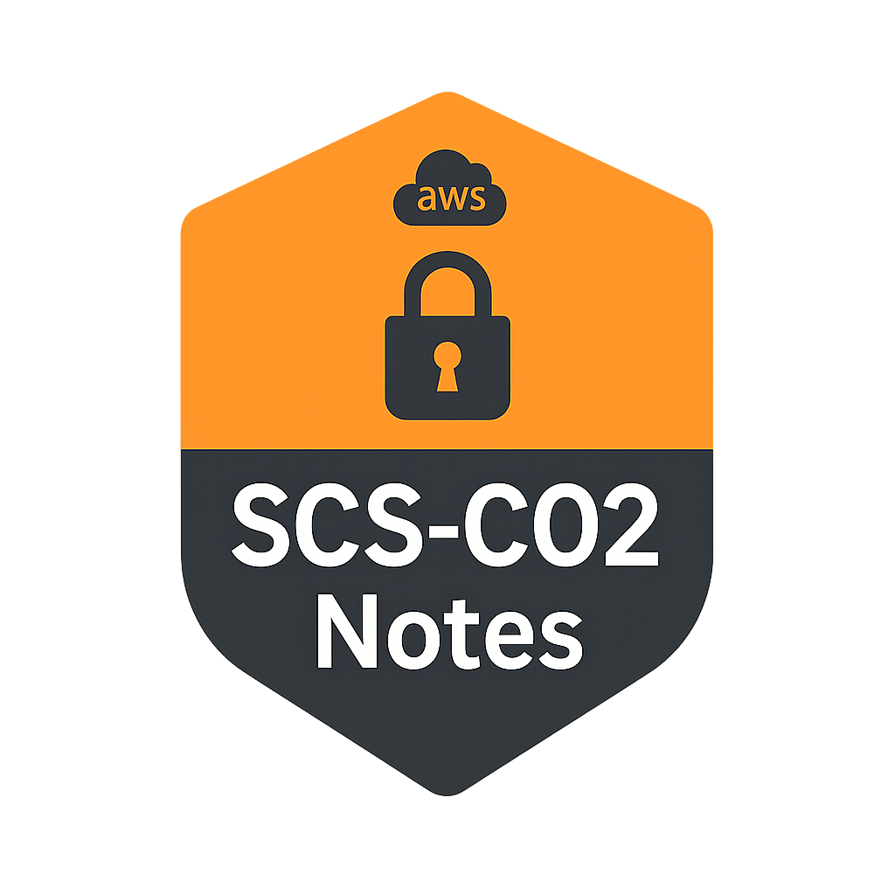

  

<h1 align="center">AWS Specialty SCS-C02&nbsp;Notes</h1>

  
  
  

> **A curated collection of everyday study notes, real-world scenario analyses, and hands-on demos for the AWS Certified Security – Specialty (SCS-C02) exam.**  
> **AWS セキュリティ専門資格（SCS-C02）学習のためのシナリオ分析・実践メモ集です。**

---

## ✨ About This Project / このプロジェクトについて

| ❓ Why / なぜ | ⚙️ How / どうやって |
|--|--|
| **EN**  Turn scattered notes into a structured knowledge base—easy to review, easy to share.  **JP**  断片的なメモを体系化し、復習と共有を楽にするため。| **EN**  GitHub Actions keeps TOCs up-to-date; a shell script collects every H1 across the repo and injects them into the README index.  **JP**  GitHub Actions で TOC を自動更新。シェルスクリプトが各 *.md* の H1 を取得し、README のインデックスに反映します。|

---

## 🤝 Contributing / コントリビュート方法

1. **Fork & PR** — *typos, alternative solutions, brand-new scenarios are all welcome!*  
   **フォークして PR を送ってください。タイプミス修正、新しいアプローチ、シナリオ追加など何でも OK！**  
2. **Found a mistake or better practice?**    
   Open an **Issue**—even a one-line correction may save future readers!  
   **誤りや改善案は Issue でお知らせください。小さな指摘でも大助かりです 🙏**  

---

---

<!-- START doctoc generated TOC please keep comment here to allow auto update -->
<!-- DON'T EDIT THIS SECTION, INSTEAD RE-RUN doctoc TO UPDATE -->

<!-- END doctoc generated TOC please keep comment here to allow auto update -->

<!-- docs-index:start -->

- [AWS Lambda × S3 Secure Design for Serverless Image Processing Systems](Scenario1_en.md)
- [AWS Lambda × S3 ：サーバーレス画像処理システムの安全設計](Scenario1_ja.md)
- [AWS Lambda × S3: Secure Architecture for Cross-Account Serverless Image Processing](Scenario2_en.md)
- [AWS Lambda × S3 ：クロスアカウントサーバーレス画像処理システムの安全設計](Scenario2_ja.md)
- [AWS EC2 × SSM：セキュリティインシデント対応プロセスの安全設計（メモリ保持と隔離）](Scenario3_ja.md)

<!-- docs-index:end -->
