<!-- START doctoc generated TOC please keep comment here to allow auto update -->
<!-- DON'T EDIT THIS SECTION, INSTEAD RE-RUN doctoc TO UPDATE -->
**Table of Contents**

- [AWS Direct Connect × Site‑to‑Site VPN-EN](#aws-direct-connect-%C3%97-site%E2%80%91to%E2%80%91site-vpn-en)
  - [Low‑Latency & IPsec Connectivity Design Document](#low%E2%80%91latency--ipsec-connectivity-design-document)
  - [📘 Scenario](#-scenario)
  - [🎯 Test Points](#-test-points)
  - [✅ Summary](#-summary)
  - [🛠️ Implementation Example](#-implementation-example)
    - [1. High‑level Network Layout](#1-high%E2%80%91level-network-layout)
    - [2. BGP Routing Example](#2-bgp-routing-example)
    - [3. CloudFormation Snippet (CGW & VPN)](#3-cloudformation-snippet-cgw%C2%A0%C2%A0vpn)
  - [🔐 Key Security Settings](#-key-security-settings)
  - [🚦 Operational Best Practices](#-operational-best-practices)

<!-- END doctoc generated TOC please keep comment here to allow auto update -->

# Low-Latency, IPsec-Encrypted Hybrid Architecture: Direct Connect + Site-to-Site VPN for On-Prem DB Compliance
Low‑Latency & IPsec Connectivity Design Document
---

## 📘 Scenario

- Legacy applications are being *gradually* migrated to AWS (EC2, etc.), while the **database must remain on‑premises** for compliance.  
- The database is **extremely sensitive to network latency**.  
- All traffic between the on‑prem data center and AWS **must be encrypted with IPsec**.  
- The architecture should stay highly available **and** be easy to extend to multiple VPCs or Regions in the future.

---

## 🎯 Test Points

1. Can we introduce a dedicated circuit that guarantees low latency and high bandwidth?  
2. How do we build an IPsec *Site‑to‑Site* VPN tunnel?  
3. Redundancy patterns if either Direct Connect **or** VPN fails.  
4. Optimising BGP routing & prefix advertisements (on‑prem ⇄ VPC).  
5. Ease of future growth using Transit Gateway or other constructs.

---

## ✅ Summary

| Option | Evaluation |
|--------|------------|
| **A. Site‑to‑Site VPN** | Provides IPsec encryption, but rides the public Internet – latency is unpredictable. Bandwidth capped at 1.25 Gbps. ❌ |
| **B. Direct Connect** | Delivers low latency and private bandwidth, but offers *no native encryption*. ❌ |
| **C. VPN CloudHub** | Useful for multi‑site VPN, yet does **not** fix the latency requirement. ❌ |
| **D. VPC Peering** | Meant for VPC‑to‑VPC inside AWS; can’t connect on‑prem. ❌ |
| **E. NAT Gateway** | Irrelevant to both encryption and latency. ❌ |
| **✔ Recommended → Direct Connect + Site‑to‑Site VPN** | Use Direct Connect (DX) for stable, low‑latency bandwidth, and run an IPsec VPN tunnel *over* DX to satisfy encryption. **AWS‑recommended hybrid pattern.** |

---

## 🛠️ Implementation Example

### 1. High‑level Network Layout

```mermaid
flowchart LR
  OnPrem[On‑Prem DC] -- Private VIF --> DX(DX Location)
  DX -- VGW link --> VGW[(Virtual Private Gateway)]
  subgraph AWS VPC
    EC2[App Server]
  end
  OnPrem -- IPsec VPN --> VGW
```



* **Direct Connect** – 1 Gbps / 10 Gbps circuit, **Private VIF → VGW**  
* **Site‑to‑Site VPN** – Two redundant IPsec tunnels on the same VGW (IKEv2, AES‑256/SHA‑2, ECDH P‑256)  
* **BGP** – Same ASN (e.g. 64512) on DX & VPN; DX preferred via *Weight* / LocalPref  
* **Backup** – Secondary DX location **or** Internet VPN for HA

### 2. BGP Routing Example

| Peer | Local ASN | Remote ASN | Advertised Prefix |
|------|-----------|------------|-------------------|
| DX‑BGP  | 64512 | 7224  | 10.0.0.0/16 |
| VPN‑BGP | 64512 | 65001 | 172.16.0.0/24 |

### 3. CloudFormation Snippet (CGW & VPN)

```yaml
Resources:
  CorpCustomerGateway:
    Type: AWS::EC2::CustomerGateway
    Properties:
      BgpAsn: 65001
      IpAddress: 203.0.113.10   # On‑prem router
      Type: ipsec.1

  CorpVPN:
    Type: AWS::EC2::VPNConnection
    Properties:
      Type: ipsec.1
      CustomerGatewayId: !Ref CorpCustomerGateway
      VpnGatewayId: !Ref MyVGW
      StaticRoutesOnly: false
```

---

## 🔐 Key Security Settings

| Item | Setting |
|------|---------|
| Encryption algorithm | AES‑128/256 + SHA‑256 (ESP, IKEv2) |
| Key exchange | ECDH Group 19/20 (P‑256 / P‑384) → Perfect Forward Secrecy |
| Mode | ESP **Tunnel** mode (encrypts whole packet) |
| NAT‑T | Not required over DX; allow UDP 4500 for Internet backup VPN |
| Rekey interval | Short lifetime (e.g. 8 h / 1 h) to rotate keys regularly |

---

## 🚦 Operational Best Practices

1. **Monitoring** – Use CloudWatch metrics (VPN TunnelState, DX ConnectionState) → EventBridge → SNS.  
2. **Fail‑over** – Prefer DX via BGP Weight / LocalPref; fall back to VPN if DX is down.  
3. **Performance tests** – Periodically run *iperf3* or export CloudWatch Metric Streams for latency & throughput baselines.  
4. **Compliance** – Share AWS Artifact (SOC 2, ISO 27001) reports with auditors.  
5. **Scalability** – For many VPCs, centralise routing with **Transit Gateway + DX Gateway**.

---

By combining **Direct Connect for low latency** with an **IPsec Site‑to‑Site VPN for encryption**, you achieve secure and fast connectivity to the on‑prem database—meeting both performance *and* compliance requirements.
