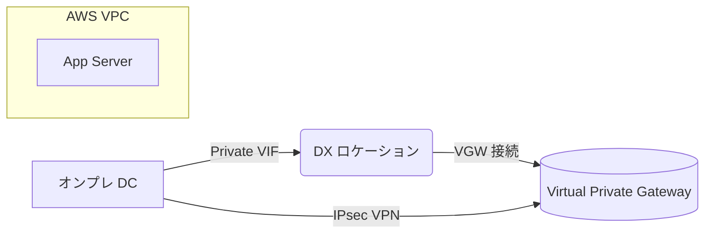

<!-- START doctoc generated TOC please keep comment here to allow auto update -->
<!-- DON'T EDIT THIS SECTION, INSTEAD RE-RUN doctoc TO UPDATE -->
**Table of Contents**

- [Direct Connect×IPsecで実現する低遅延・高可用なオンプレDB接続構成](#direct-connect%C3%97ipsec%E3%81%A7%E5%AE%9F%E7%8F%BE%E3%81%99%E3%82%8B%E4%BD%8E%E9%81%85%E5%BB%B6%E3%83%BB%E9%AB%98%E5%8F%AF%E7%94%A8%E3%81%AA%E3%82%AA%E3%83%B3%E3%83%97%E3%83%ACdb%E6%8E%A5%E7%B6%9A%E6%A7%8B%E6%88%90)
  - [📘 Scenario（シナリオ）](#-scenario%E3%82%B7%E3%83%8A%E3%83%AA%E3%82%AA)
  - [🎯 Test Points（考察ポイント）](#-test-points%E8%80%83%E5%AF%9F%E3%83%9D%E3%82%A4%E3%83%B3%E3%83%88)
  - [✅ Summary（まとめ）](#-summary%E3%81%BE%E3%81%A8%E3%82%81)
  - [🛠️ 実装例](#-%E5%AE%9F%E8%A3%85%E4%BE%8B)
    - [1. ネットワーク構成](#1-%E3%83%8D%E3%83%83%E3%83%88%E3%83%AF%E3%83%BC%E3%82%AF%E6%A7%8B%E6%88%90)
    - [2. BGP ルーティング例](#2-bgp-%E3%83%AB%E3%83%BC%E3%83%86%E3%82%A3%E3%83%B3%E3%82%B0%E4%BE%8B)
    - [3. CloudFormation スニペット（CGW & VPN）](#3-cloudformation-%E3%82%B9%E3%83%8B%E3%83%9A%E3%83%83%E3%83%88cgw--vpn)
  - [🔐 セキュリティ設定要点](#-%E3%82%BB%E3%82%AD%E3%83%A5%E3%83%AA%E3%83%86%E3%82%A3%E8%A8%AD%E5%AE%9A%E8%A6%81%E7%82%B9)
  - [🚦 運用ベストプラクティス](#-%E9%81%8B%E7%94%A8%E3%83%99%E3%82%B9%E3%83%88%E3%83%97%E3%83%A9%E3%82%AF%E3%83%86%E3%82%A3%E3%82%B9)

<!-- END doctoc generated TOC please keep comment here to allow auto update -->

# Direct Connect×IPsecで実現する低遅延・高可用なオンプレDB接続構成

---

## 📘 Scenario（シナリオ）

- レガシーアプリを AWS（EC2 など）へ段階的に移行しつつ、**法規制によりオンプレミスに残る DB** へ高頻度アクセスが必要  
- DB は **ネットワーク遅延に敏感**  
- オンプレ ⇄ AWS 間の通信経路は **IPsec で暗号化** されていなければならない  
- 可用性・拡張性を維持しつつ、将来的なマルチ VPC／マルチリージョン展開にも対応できる構成が望ましい  

---

## 🎯 Test Points（考察ポイント）

1. 低遅延・高帯域を保証する専用線の導入可否  
2. IPsec Site‑to‑Site VPN による暗号化トンネルの張り方  
3. Direct Connect／VPN それぞれの障害時に通信を継続する冗長パターン  
4. BGP ルーティングと Prefix 広報の最適化  
5. Transit Gateway などを用いた将来拡張のしやすさ  

---

## ✅ Summary（まとめ）

| 選択肢 | 評価 |
|-------|------|
| A. Site‑to‑Site VPN | IPsec は満たすがインターネット経路のためレイテンシが不安定。帯域上限 1.25 Gbps。 ❌ |
| B. Direct Connect | 低遅延・専用線帯域は確保できるが暗号化がネイティブでは無い。 ❌ |
| C. VPN CloudHub | 複数拠点 VPN 向け。遅延要件を満たせない。 ❌ |
| D. VPC Peering | オンプレ接続に利用できない。 ❌ |
| E. NAT Gateway | 暗号化・遅延どちらにも直接関与しない。 ❌ |
| **✔ 推奨: Direct Connect + Site‑to‑Site VPN** | **DX で帯域と遅延を最適化し、その上に IPsec VPN を張ることで暗号化要件も充足。AWS 推奨ハイブリッドモデル。** |

---

## 🛠️ 実装例

### 1. ネットワーク構成



- **Direct Connect**: 1 Gbps / 10 Gbps 回線、Private VIF → VGW  
- **Site‑to‑Site VPN**: 同一 VGW に 2 本の IPsec トンネル（IKEv2, AES‑256/SHA‑2, ECDH P‑256）  
- **BGP**: DX と VPN で同一 ASN (例 64512) を使用し、Weight/AS‑Path で DX 優先  
- **バックアップ**: 別 DX ロケーションまたは Internet VPN を追加して HA  

### 2. BGP ルーティング例

| ピア | Local ASN | Remote ASN | Advertised Prefix |
|------|-----------|-----------|-------------------|
| DX‑BGP | 64512 | 7224 | 10.0.0.0/16 |
| VPN‑BGP | 64512 | 65001 | 172.16.0.0/24 |

### 3. CloudFormation スニペット（CGW & VPN）

```yaml
Resources:
  CorpCustomerGateway:
    Type: AWS::EC2::CustomerGateway
    Properties:
      BgpAsn: 65001
      IpAddress: 203.0.113.10   # オンプレルータ
      Type: ipsec.1

  CorpVPN:
    Type: AWS::EC2::VPNConnection
    Properties:
      Type: ipsec.1
      CustomerGatewayId: !Ref CorpCustomerGateway
      VpnGatewayId: !Ref MyVGW
      StaticRoutesOnly: false
```

---

## 🔐 セキュリティ設定要点

| 項目 | 設定 |
|------|------|
| 暗号方式 | AES‑128/256 + SHA‑256 (ESP, IKEv2) |
| 鍵交換 | ECDH Group 19/20 (P‑256/P‑384) ⇒ Perfect Forward Secrecy |
| トンネルモード | ESP トンネルモード (元パケット全体暗号化) |
| NAT‑T | DX 上では不要 / Backup VPN では UDP 4500 許可 |
| 鍵更新 | SA ライフタイム短縮 (例 8 h / 1 h) で定期再キー生成 |

---

## 🚦 運用ベストプラクティス

1. **監視** – CloudWatch VPN 及び DX メトリクスを EventBridge → SNS で通知  
2. **フェイルオーバー** – ルートテーブル優先度 (BGP Weight/Local Pref) で DX 優先・VPN バックアップ  
3. **性能検証** – iPerf3 / CloudWatch Metric Streams でレイテンシ & スループットを定点観測  
4. **コンプライアンス** – AWS Artifact (SOC 2, ISO 27001 など) レポートを監査部門へ共有  
5. **拡張性** – マルチ VPC 接続は Transit Gateway + DX Gateway で集中ルーティング  

---

これにより **低遅延 (Direct Connect) と IPsec 暗号化 (Site‑to‑Site VPN)** を同時に実現し、オンプレ DB への安全かつ高速なアクセスを確保できます。
